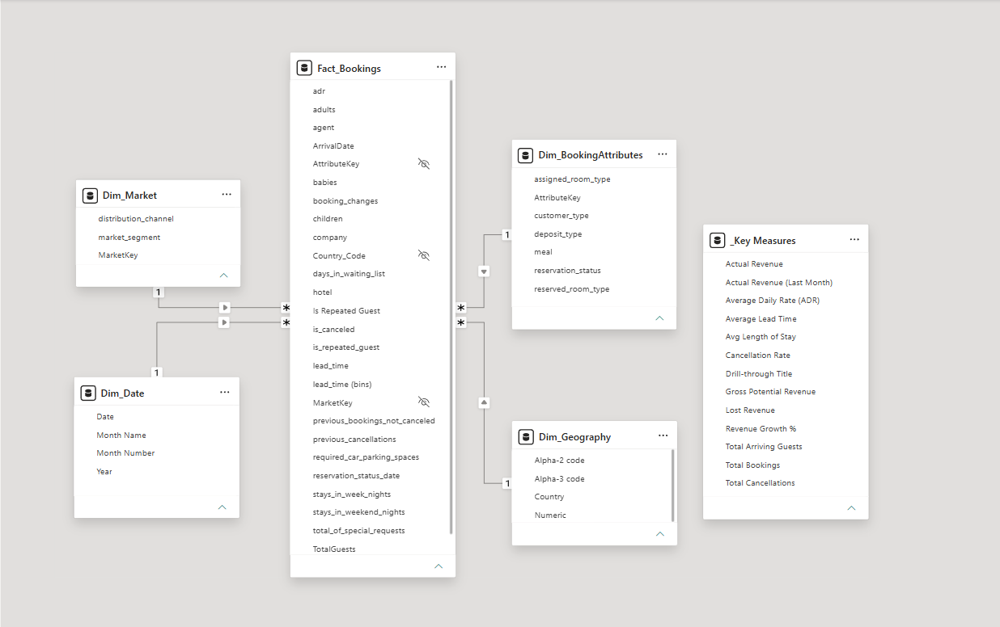
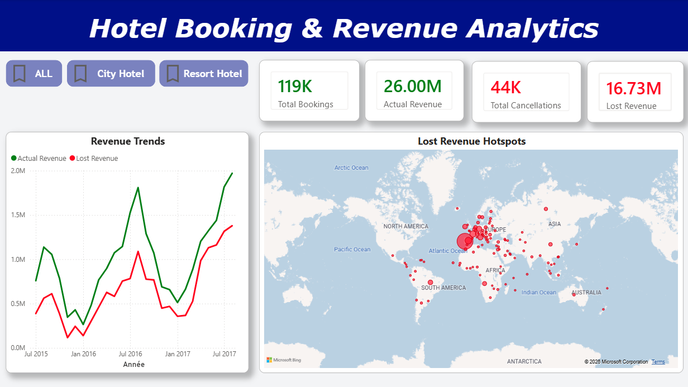
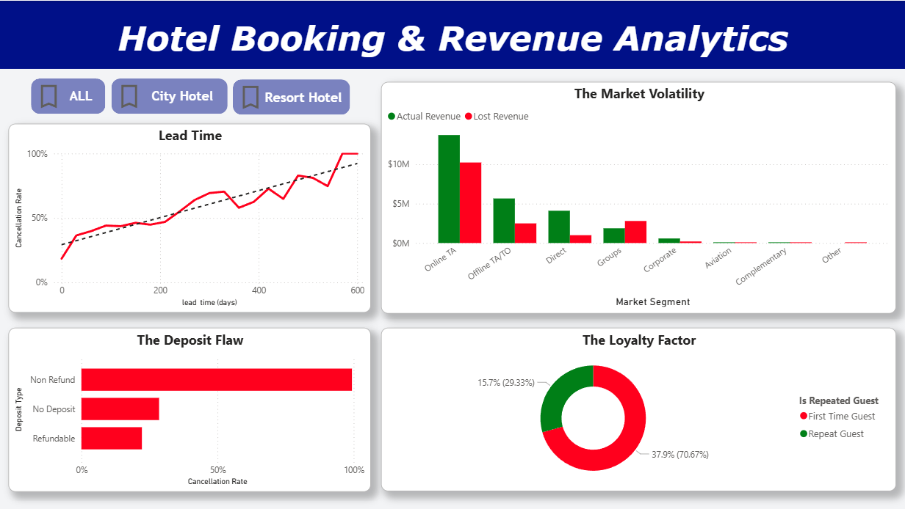
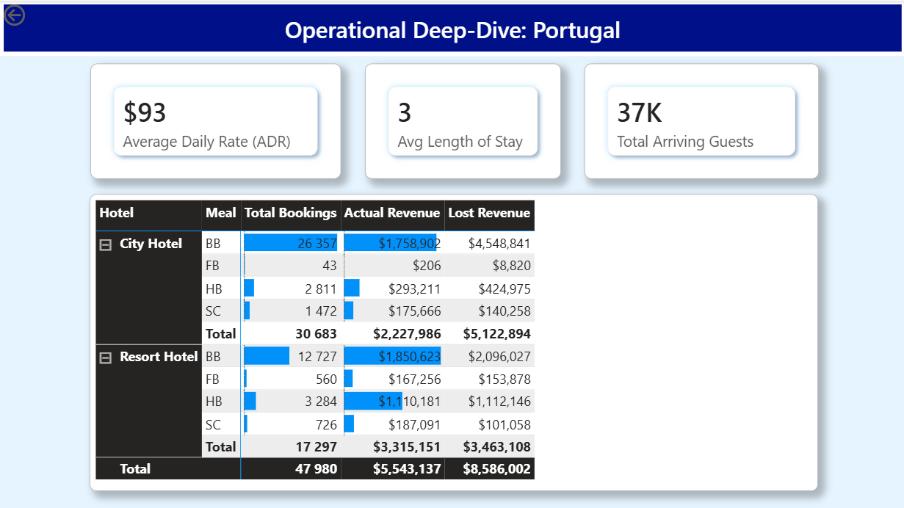

# Hotel Revenue & Cancellation Analytics - Power BI 🏨

## 📌 Project Overview
This project is an end-to-end Data Analytics solution designed to uncover the root causes of hotel booking cancellations and track revenue leakage. I analyzed a dataset of nearly 120,000 hotel bookings (City & Resort) to identify high-risk guest profiles and operational inefficiencies. 

**Tools Used:** Power BI, Power Query, DAX, Data Modeling

## 🏗️ Data Architecture & ETL
The raw data contained several anomalies (negative ADR, zero-night stays, impossible occupancies). I utilized **Power Query** to cleanse the data and architected an optimized **Star Schema**:
* **Fact Table:** `Fact_Bookings` (containing numeric KPIs and foreign keys).
* **Dimension Tables:** `Dim_Date`, `Dim_Hotel`, `Dim_Geography`, `Dim_Market`, and a consolidated "Junk Dimension" `Dim_BookingAttributes`.

## 📊 Key DAX Measures
I avoided calculated columns to ensure optimal performance, creating explicit measures including:
* **Cancellation Rate:** `DIVIDE([Total Cancellations], [Total Bookings], 0)`
* **Lost Revenue:** `CALCULATE([Gross Potential Revenue], 'Fact_Bookings'[is_canceled] = 1)`
* **Time-Intelligence:** Month-over-Month Revenue Growth %

## 💡 Top Business Insights
1. **The Deposit Flaw:** Bookings marked as "Non-Refundable" have an unexpectedly high cancellation rate (nearly 100%), exposing a massive vulnerability in how OTA credit card holds are processed.
2. **Lead Time Volatility:** The data proves a direct linear relationship: the further in advance a booking is made, the higher the risk of cancellation. 
3. **The Value of Loyalty:** Repeat guests have a dramatically lower cancellation rate compared to first-time transient guests. 

## 📸 Dashboard Gallery

### 1. Executive Overview
Features dynamic KPIs, semantic coloring (Red = Lost Revenue, Green = Actual), and a custom Tooltip for MoM growth.

### 2. Cancellation Deep-Dive
Uncovers the root causes of lost revenue via Market Segments and Deposit Types.

### 3. Country Drill-Through
Interactive navigation allowing users to drill down from the global map into specific country operations.

---
*This project was completed as part of the Data Analytics certification from GOMYCODE.*
